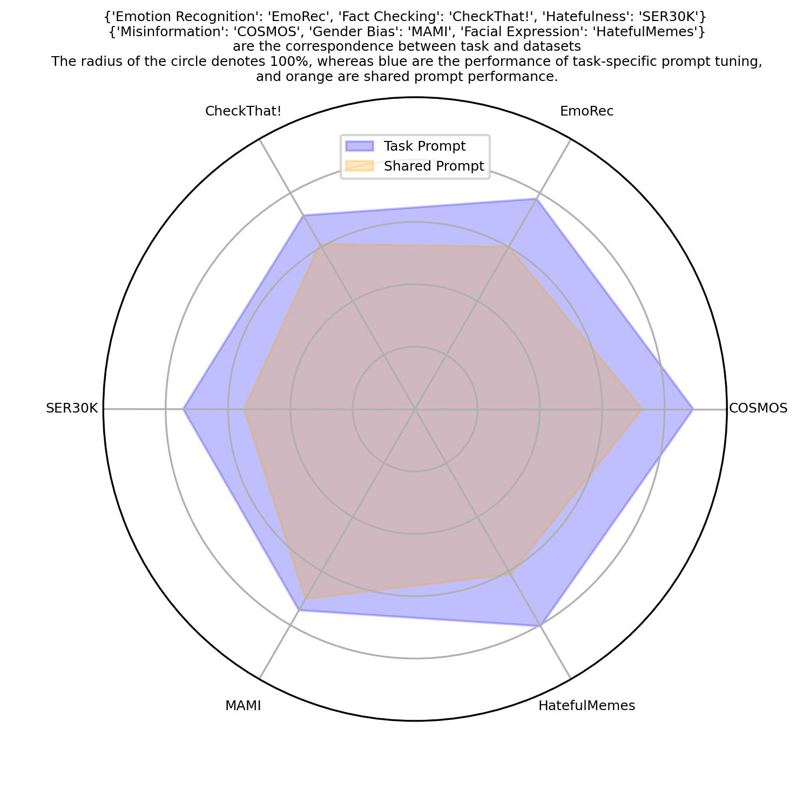

# Flype :flying_disc: : Foundational Models for Parameter Efficient Visual Language Understanding

## Update
Find our demo at http://flype.mtop.uk, or at [BackupLink](https://5e0cf93cee8f318447.gradio.live)

Our winning model written in [LAVIS](https://github.com/salesforce/LAVIS) for [CheckThat!](https://checkthat.gitlab.io/clef2023/task1/) is now available at [Flype-LAVIS](https://github.com/pengbohua/Flype-LAVIS)!
## Overview
To perform parameter-efficient visual language classification, we select the VQA foundation model, BLIP-2. 
As shown in the following figures, we propose parameter-efficient prompt-based learning, FLYPE, for visual language understanding in computational social science (CSS). 
The method consists of two stages: a cross-modal continuous prompt tuning stage and a prompt fusion stage.
<figure>

    <figcaption style="text-align: center">Fig. 1 FLYPE utilizes a Query Transformer, or Q-former, and an LLM decoder. The Q-former is coloured in purple in Figure 1. The soft instruction tokens prompt the Q-former that hinges text and image modalities with little training cost. FLYPE predicts final labels based on visual query tokens from the Q-former and the last token of the LLM decoder.</figcaption>
</figure>

<figure>

    <figcaption style="text-align: center">Fig. 2 Prompt fusion: fusing three trained prompts for another three held-out datasets of different tasks.</figcaption>
</figure>

## Run the code
Run the following code for your favorite task.
```python
python sweep.py
wandb agent  Entity/ProjectName/SweepID
```
## Multi-task prompt tuning performance

<figure>

    <figcaption style="text-align: center">Figure 3. Comparison between the performance of task-specific prompt tuning and prompt fusion.</figcaption>
</figure>
