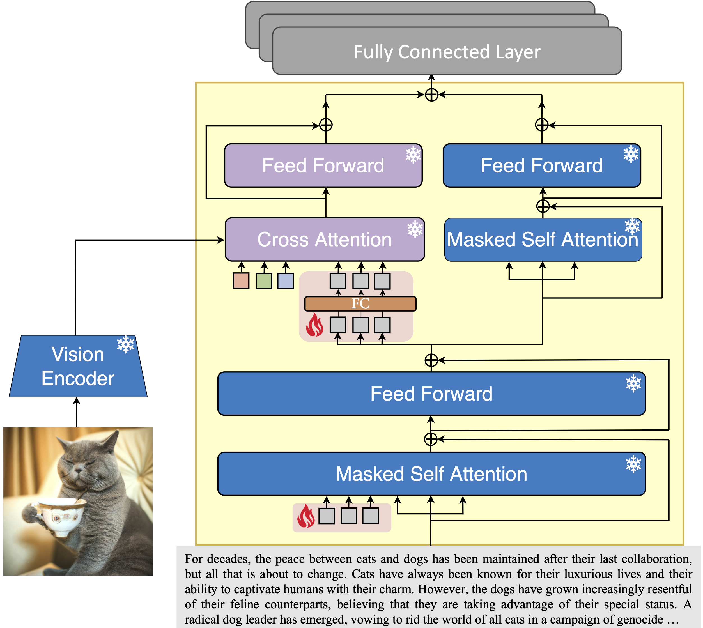
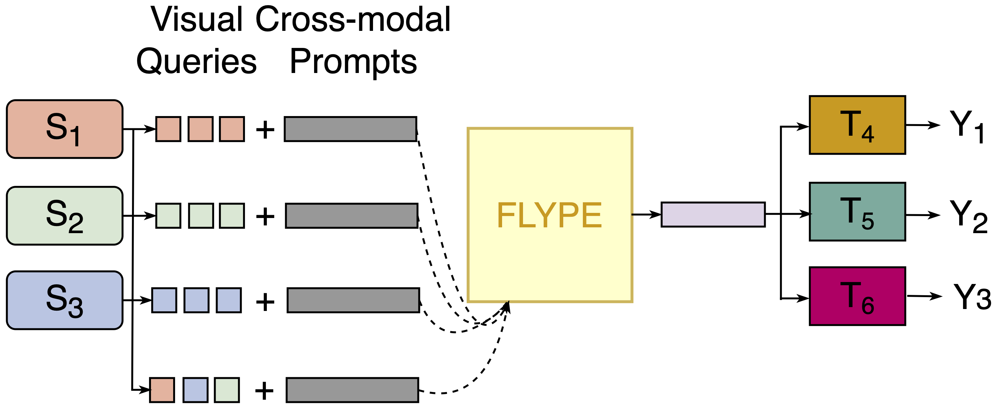

# Flype :flying_disc: : Foundational Models for Parameter Efficient Visual Language Understanding

## Overview
This repository contains the code of the **meta** foundation model FLYPE to perform visual language understanding. 

